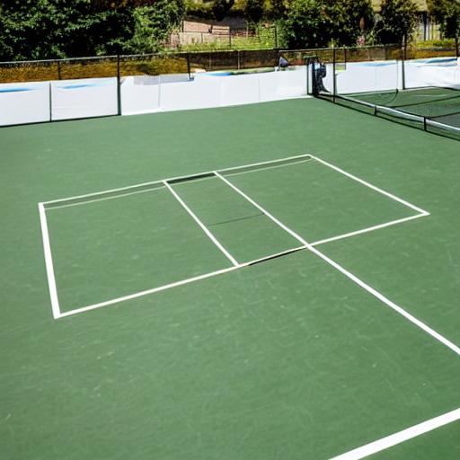
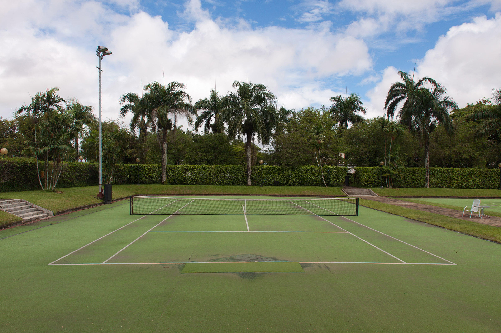
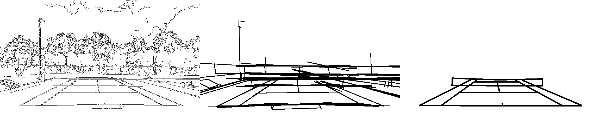
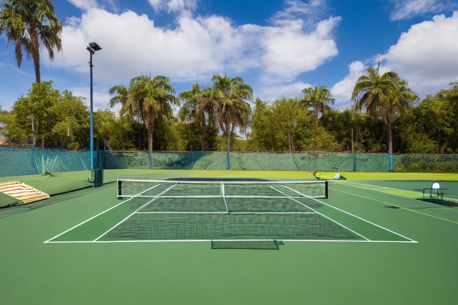
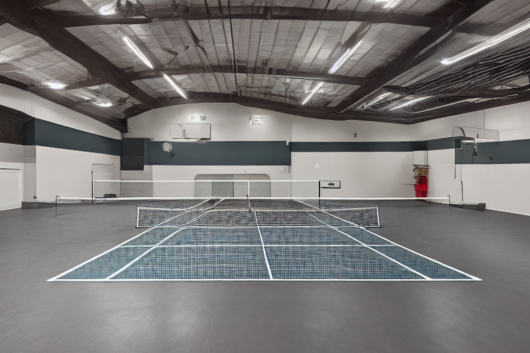
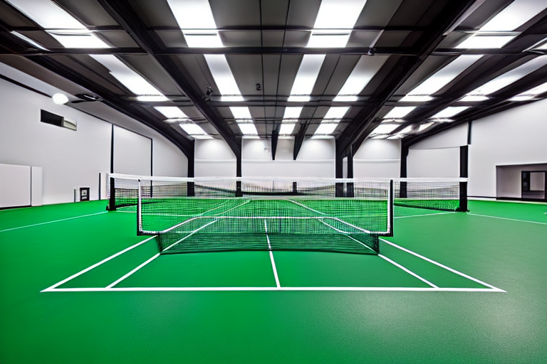
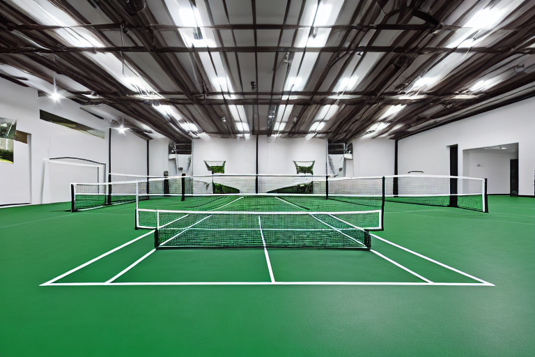
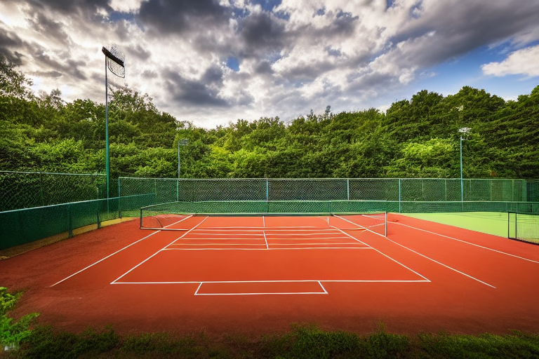
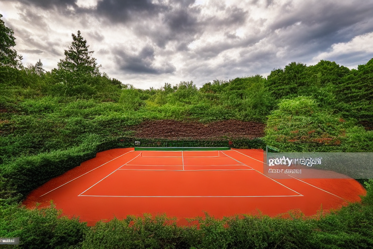
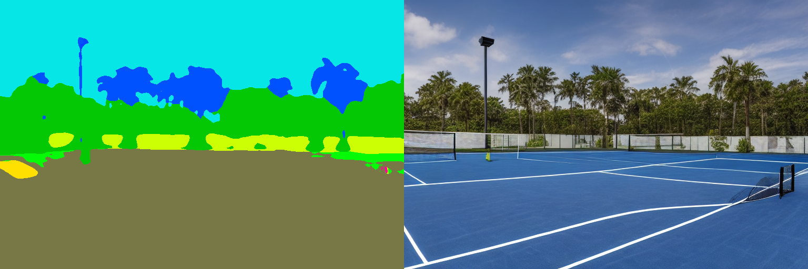

- What did you do?
- ~~Where did you download the code (including links)? Did you change anything and (if so) what?~~
- ~~Did you have problems running the code? If so, how did you fix them?~~
- Which tests did you perform and what are the results? Discuss the results and include images and figures.

# Overview

TODO: Describe "What did you do?"
TODO: Maybe Describe what the paper is about (no details, just short general idea)
Paper link: https://arxiv.org/abs/2302.05543

# Installation & Setup
The code for ControlNet was downloaded from the official python implementation[1] and placed into src/ControlNet.

The pretrained models were downloaded from HuggingFace[2] and put into the src/ControlNet/models folder. As the pretrained models are quite large, we did not include them in our submission.

A python virtual environment can be created using the requirements.txt file we added, with updated pytorch versions compared to the original implementation. For faster inference, and even lower memory consumption we also installed the xformers library (see Github issue [4]).

## Changes
To allow inference with graphics card having 8GB of RAM, we use the low memory mode, setting the save_memory variable under config.py to True.


To get the code running with the newer package versions, the import from the rank_zero_only from the pytorch_lightning module, had to be changed from 
```
    from pytorch_lightning.utilities.distributed import rank_zero_only
```
to
```
    from pytorch_lightning.utilities.rank_zero import rank_zero_only
```
in two seperate files:
- src/ControlNet/cldm/logger.py
- src/ControlNet/ldm/models/diffusion/ddpm.py

## Usage

To run our experiments, we used the provided gradio Scripts(gradio_*.py).

# Tests
## Synthetic data generation

In the first test, we want to see whether we can use ControlNet to create synthetic datasets for keypoint detection models.

The idea for this test came from previous experiments with standard diffusion models. We encountered two main problems when generating such data using diffusion models without any conditional input:

- The created images are not correct
- We not have labels for the generated data




*Figure 1: Tennis Court generated using stable diffusion 1.5*

Our hypothesis is, that ControlNet can overcome those problems as we have conditional input from real images. This should allow ControlNet to void generating wrong geometry. Furthermore, if we know the labels (i.e. Keypoint Location) for the Real images, we can use those labels also for the generated output. Sometimes, the preprocessing automatically yields the desired labels, for example when using estimated poses from the original image as the conditional input.

We will test this hypthesis on the example of tennis court recognition. Note that we will not perform quantitive tests, or train actual models using the generated data.

All of the conditional inputs for this Task are based on the same reference image, which was taken from [3].




*Figure 2: Tennis Court Reference Image*


### Line Annotations

*Figure 3: Different conditional inputs.
Left: Canny Edge Detection, Middle: Hough Lines, Right: Scribble*
We obtained the best results, when using conditional inputs that preserve much about the information of the tennis court.



*Figure 4: Generated Image using canny edges as condition*

When using the canny edges as conditional input, we see that the generated input matches the reference image closely in the background, due to the high number of edges in the conditional input image. This is not the case when using the scribble as conditional input, as the scribble only contains information about the tennis court itself.


The following images were all generated using the following prompt:

```indoor tennis court, no players, concrete walls, ceiling lighting```
<p float="left">
  
   
  
</p>

*Figure 5: Images generated using the scribble as annotation, with different parameters for Guidance and Number of diffusion steps*

We did not notice siginificant differences in the images when altering the guidance scale or number of diffusion steps.

In the above Images, as well as on other generated images, we noticed that the biggest problem for the model is the accurate generation of the net.




*Figure 6: Wrong court geometry when using Hough lines as conditional input*

### Stock photo text prompt
We tried generating realistic images, by adding "stock photo" to the text prompt.

Using the following prompt:
```red clay tennis court, stock photo, no players```
we noticed however that this can generate artefacts, as seen in Figure 6.



*Figure 7: Generated image with visible artefact due to "stock photo" text prompt*

### Semantic Segmentation Annotations

Using semantic annotations as the conditional input for the diffusion model, did not bring good results for this task. This makes sense, as the semantic segmentation does not contain any information about the geometry of the tennis court, but only where the tennis court is compared to the background.


*Figure 8: Left: Semantic Segmentation Annotation Right: Generated Image*

### Conclusion

While we see that the generated images from ControlNet are much more accurate compared to images generated with unconditioned diffusion models, the geometry is still not perfect. The lines of the tennis court are usually perfectly placed on top of the annotation lines. Sometimes there are additional lines or even nets that are not supposed to be there.

More indepth experiments, or better knowledge of prompt engineering could perhaps increase the quality of the generated images. Concluding, we can say that ControlNet could be a good tool for generating synthetic data, however it is not perfect and requires some experimentation, and most likely manual confirmation of the generated images to get images that can be used for training neural networks.

Better results could be obtained by training a specific model with a custom conditional input for this task, instead of using pretrained models.

## Test 2: TODO: (Maybe not even needed? Report should be ~4 pages)

# References
[1] https://github.com/lllyasviel/ControlNet, accessed on 19.06.2023

[2] https://huggingface.co/lllyasviel/ControlNet, accessed on 19.06.2023

[3] https://freerangestock.com/photos/39555/tennis-court.html, accessed on 19.06.2023

[4] https://github.com/lllyasviel/ControlNet/issues/3, accessed on 19.06.2023
